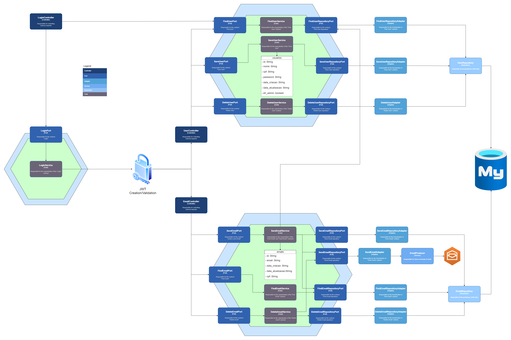

# auth-email-service

Stack a utilizada:
- Java 21
- Spring Boot
- Spring Security
- MySQL
- Maven
- Mail Sender
- OpenAPI
- JUnit 5

Requisitos Funcionais:

1. Tabelas:<br><br>
   - Usuários (usuarios): com os campos id, nome, cpf, password,
   data_criacao, data_atualizacao, eh_admin.
   - Emails (emails): com os campos id, email, data_criacao,
   data_atualizacao. <br><br>
   
2. Endpoints: <br>
- Login: Deve permitir o login apenas de usuários cujo campo eh_admin seja
   igual a true.
- Usuários:
  -  Visualizar um usuário específico.
  - Listar todos os usuários.
  -  Criar um novo usuário.
  -  Alterar um usuário existente.
  -  Deletar um usuário.
  -  Obs.: Apenas usuários administradores (eh_admin = true) podem
  acessar esses endpoints. 
- Emails:
  - Visualizar os emails de um usuário específico.
  - Listar todos os emails de um usuário.
  - Criar um novo email.
  - Deletar um email.
  - Obs.: Apenas usuários administradores (eh_admin = true) podem acessar esses endpoints. <br><br>
3. Envio de Email: <br><br>
   - Sempre que um email for cadastrado ou deletado, o sistema deve enviar um  email para todos os usuários administradores (eh_admin = true).
   - O título do email deve ser: "O email xxxx@xx.com foi criado/alterado para o
   usuário de CPF 9999".
###
Como bônus este projeto oferece uma documentação facilitada, que pode ser acessada em:
```
localhost:8080/swagger-ui/index.html
```
## Arquitetura de Solução

Neste desafio a construção do Microsserviço foi feita a partir da <b><i>arquitetura Hexagonal</b></i>.

A imagem abaixo é a arquitetura de solução proposta para este teste


